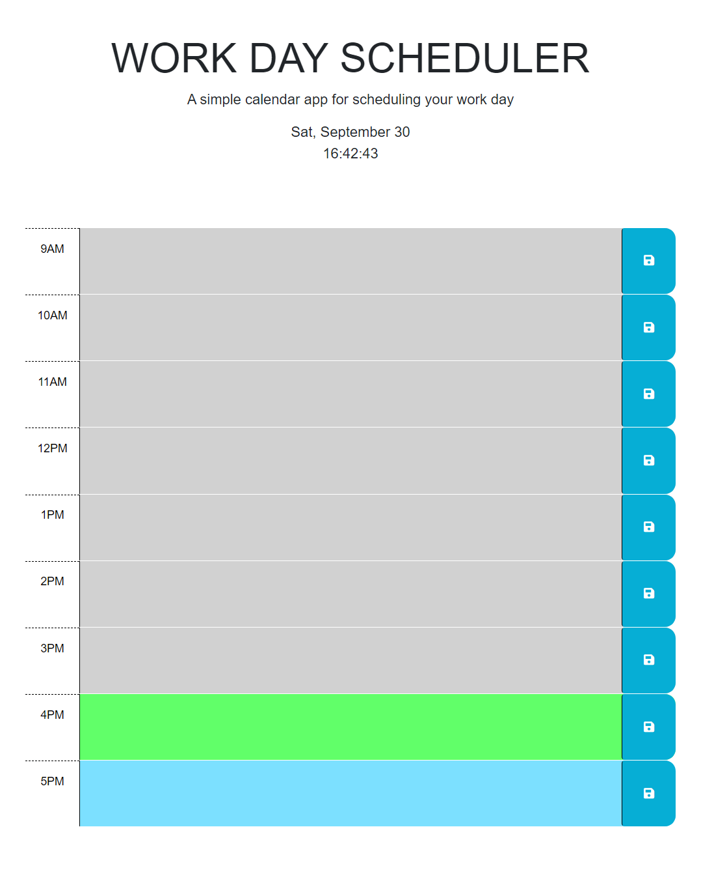

# Daily-Agenda

This application is an agenda that allows users to store and manage their daily activities. It provides a user-friendly interface to add, update, and delete activities. The agenda also displays the status of each activity, indicating whether it has already been completed, is currently ongoing, or is scheduled for the future.

## How it works

To use the application, users can navigate through the different sections of the agenda to view their activities. Users can add new activities by clicking on the "Save" icon button and filling out the necessary information.
Users can also edit or delete existing activities to keep their agenda up to date.

Color code for tasks:

     Completed: Grey

     Currently happening: Green

     Future: Blue
## URL to deployed App 

https://andatax.github.io/Daily-Agenda/ 

## Screenshot of the UI of the web application

